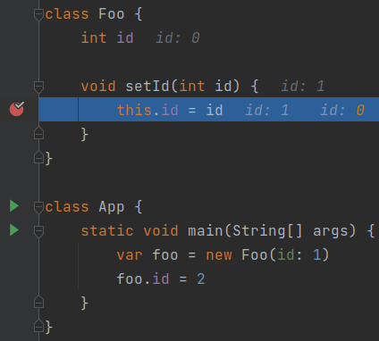
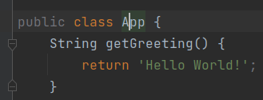
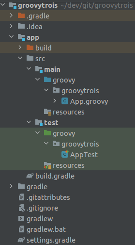

# Groovy (3), le langage JVM orienté productivité

## Table of Contents

- [Groovy (3), le langage JVM orienté productivité](#groovy-3-le-langage-jvm-orient-productivit)
    - [I. Intro](#i-intro)
    - [II. Les facettes de Groovy](#ii-les-facettes-de-groovy)
	- [1.) Une courbe d’apprentissage plate](#1-une-courbe-dapprentissage-plate)
	- [2.) Convention-over-configuration](#2-convention-over-configuration)
	    - [a.) List et map Literals](#a-list-et-map-literals)
		- [1. List literals](#b-list-literals)
		- [2. Et idem pour les map](#c-et-idem-pour-les-map)
	    - [b.) Default getters and setters](#b-default-getters-and-setters)
	    - [c.) Les affectations sont des alias des setters](#c-les-affectations-sont-des-alias-des-setters)
	    - [d.) Les récupérations sont des alias des getters](#d-les-rcuprations-sont-des-alias-des-getters)
	    - [e.) Un constructeur par défaut avec des "named parameters"](#e-un-constructeur-par-dfaut-avec-des-named-parameters)
	    - [f.) Default method arguments](#f-default-method-arguments)
	    - [g.) Le scope par default est `public`](#g-le-scope-par-default-est-public)
	    - [h.) Default obvious imports](#h-default-obvious-imports)
	    - [i.) Plus besoin de l’extension `.class` :](#i-plus-besoin-de-lextension-class-)
	    - [j.) Manipuler des `File` devient simple !](#j-manipuler-des-file-devient-simple-)
	    - [k.) Plus besoin de point virgule](#k-plus-besoin-de-point-virgule)
	- [3.) Des opérateurs de haut niveau d’abstraction](#3-des-oprateurs-de-haut-niveau-dabstraction)
	    - [a.) Le Spread operator `*.`](#a-le-spread-operator-)
	    - [b.) L’equal operator `==`](#b-lequal-operator-)
	    - [c.) Elvis operator `?:`](#c-elvis-operator-)
	    - [d.). Safe Operators `?.` et `?[]`](#d-safe-operators-et-)
	    - [e.). Elvis assignment operator](#e-elvis-assignment-operator)
	    - [f.). Range operator](#f-range-operator)
	    - [g.). Spaceship operator](#g-spaceship-operator)
	- [4.) Des high order functions natives sur les structures de données](#4-des-high-order-functions-natives-sur-les-structures-de-donnes)
    - [III. Intégrer Groovy dans un projet Java existant](#iii-intgrer-groovy-dans-un-projet-java-existant)
    - [IV. Démarrer un projet Groovy from scratch](#iv-dmarrer-un-projet-groovy-from-scratch)
	- [1.) Grails (Groovy on Rails)](#1-grails-groovy-on-rails)
	- [2.) Springboot](#2-springboot)
	- [3.) Micronaut](#3-micronaut)
	- [4.) Gradle](#4-gradle)
    - [V. Notre prod n’est pas prête pour Groovy, mais notre stack de test l’est, comment faire ?](#v-notre-prod-nest-pas-prte-pour-groovy-mais-notre-stack-de-test-lest-comment-faire-)

## I. Intro

Dans les projets logiciels itératifs, incrémentaux et adaptatifs, et dans un monde où on veut réagir rapidement au
changement, on veut coder VITE, ne pas réinventer la roue (et encore moins la roue carrée).

Une lib existe pour faire ce qu’on a besoin ? Elle est stable, maintenue, ses edge case sont testés ? Ok on l’embarque
plutôt que de recoder la feature.

Dans le monde Java, on a bien des frameworks et des lib à foison remplis d’utils, de helpers, et d’annotations :

- Springboot
- Lombok
- Micronaut
- Apache commons
- Guava

Et j’en passe.

Mais on a aussi des langages !

- Kotlin
- Scala Et …
- **Groovy**

Après l’avoir utilisé dans mes stack de test, je l’ai utilisé pendant presque 2 ans en production ; je n’avais jamais
utilisé un transcodage pensées → code aussi efficace.

Cet article présente les features de Groovy (3.0.9) pour coder ses idées à toute vitesse.

## II. Les facettes de Groovy

Voilà les caractéristiques et principes qui d’après moi, permettent à Groovy d’être si efficace :

### 1.) Une courbe d’apprentissage plate

La transition Java → Groovy se fait très facilement comparé à Kotlin et Scala.

Pourquoi ?

Une ligne java compile aussi en Groovy !

Et oui, on peut donc apprendre Groovy **itérativement** depuis du Java.

### 2.) Convention-over-configuration

Les conventions plutôt que la configuration.

Admettons-le, configurer c’est lourd. C’est surtout dans le design et l’écriture du code métier qu’on souhaite dépenser
notre précieux temps.

C’est probablement pour cette raison que les frameworks Springboot et Micronaut sont si appréciés ; ils appliquent ce
concept.

Ma sélection des features Groovy qui soutiennent ce principe :

#### a.) List et map Literals

Si je devais citer UNE seule feature de Groovy, ce serait celle-ci. Déclarer et initialiser des collections et des map
en java est très très verbeux.

##### 1. List literals

Comparez vous-même pour une liste (mutable) :

Java :

```java
var users = new ArrayList<>() {{
	add(user1);
	add(user2);
	}};
```

Je suis sympa, c’est du Java 11, ce qui nous économise le type. Mais on peut aller se gratter pour la trailing-comma (
virgule finale), c’est les reviewers qui sont contents ;)

Groovy :

```groovy
var users = [user1, user2]

// Ou bien :
var user2 = [
	user1,
	user2,
]
```

Par **convention**, `users` est une `ArrayList`. Mais on aurait pu avoir un autre type de `Collection` logiquement,
voire un array :

```groovy
User[] usersArray = [
	user1,
	user2,
].toArray()

LinkedList<User> usersLinkedList = [
	user1,
	user2,
] as LinkedList

Set<User> usersSet = [
	user1,
	user2,
].toSet()

var usersForever = [
	user1,
	user2,
].asImmutable()
```

##### 2. Et idem pour les map

Java (à grand renfort d’import static) :

```java
import static java.util.Map.entry;
import static java.util.Map.ofEntries;

var userByGroup = ofEntries(
	entry(groupe4,user1),
	entry(groupe2,user2)
	);
```

Là aussi, on est très content du type dynamique, à partir de Java 11.

Mais en Groovy, c’est bouilli à la plus pure charge utile :

```groovy
var userByGroup = [
	(groupe4): user1,
	(groupe2): user2,
]
```

Aucun caractère n’est superflu. Même les parenthèses de clés sont bien de la charge utile, car elles indiquent que la
clé est une instance d’objet et non la string `"groupeX"`.

#### b.) Default getters and setters

Les getters et setters sont facultatifs et ajoutés implicitement sur tous les champs avec le scope par défaut (empty),
comme avec les record et les data/value-class Lombok.

```groovy
class Foo {
    int id
}

var foo = new Foo(id: 1)
assert foo.getId() == 1
```

#### c.) Les affectations sont des alias des setters

```groovy
foo.id = 2
// Dans le bytecode c'est foo.setId(2) qui est appelé
```

Regardez, si on surcharge le `setId` par défaut et qu’on y place un breakpoint, ce code y passe.



#### d.) Les récupérations sont des alias des getters

```groovy
foo.id = 2
// Dans le bytecode c'est foo.getId() qui est appelé
```

Il est aussi surchargeable.

#### e.) Un constructeur par défaut avec des "named parameters"

```groovy
class User {
    int id
    String name
}

var user = new User(id: 1, name: 'foo')
```

#### f.) Default method arguments

Les paramètres de méthodes peuvent être rendu facultatif :

```groovy
String foobarizeSomeStuff(String stuff1, int stuff2 = 0) {
    println "$stuff1 + : $stuff2"
}

foobarizeSomeStuff('Fizz', 8) == 'Fizz : 8'
foobarizeSomeStuff('Fizz') == 'Fizz : 0'
```

On a économisé la méthode `foobarizeSomeStuff(String stuff1)`

#### g.) Le scope par default est `public`

Plus besoin de spécifier le scope public



L’ide nous l’indique d’ailleurs en grisant les keyword facultatifs.

#### h.) Default obvious imports

Plus besoin des imports évidents, ils sont faits implicitement :

- java.lang.\*
- java.util.\*
- java.io.\*
- java.net.\*
- groovy.lang.\*
- groovy.util.\*
- java.math.BigInteger
- java.math.BigDecimal

#### i.) Plus besoin de l’extension `.class` :

```java
Class<App> appClass = App.class;
```

```groovy
Class<App> appClass = App
```

#### j.) Manipuler des `File` devient simple !

Récupérer le contenu text d’un fichier ? Trop facile. Écrire du text dans un fichier ? Pareil.

```groovy
var file = new File("asset/templates/one.tmpl")
var textContent = file.text
textContent += '''
final line
'''
file << textContent // Alias vers file.write(textContent)
```

Je vous ne le fais pas en java, car vous avez déjà en tête le bazar d'`InputStream` et `OutputStream` habituel 😉

#### k.) Plus besoin de point virgule

Attendez, je le répète.

**Plus besoin de point virgule**

C’est une étape décisive pour l’obtention d’un code avec une charge utile maximale.

### 3.) Des opérateurs de haut niveau d’abstraction

Groovy est inspiré de Python et Ruby pour ses opérateurs, dont voici mes petits préférés :

#### a.) Le Spread operator `*.`

Il permet d’invoquer une action sur tous les éléments d’une liste disposant de cette action.

```groovy
class User {
    String name
}

var users = [new User(name: 'titi'), new User(name: 'toto')]
println users*.name
```

Ici, on récupère et affiche tous les userNames.

En Java ça aurait été légèrement plus verbeux :

```java
System.out.println(users.stream().map(user -> user.getName()).collect(Collectors.toList()))
```

#### b.) L’equal operator `==`

Hein mais on a un equal-equal en java, que nous chantonne-tu ?

Oui mais celui de Groovy est en fait un alias de `.equals()` si et seulement si ce dernier existe dans la class (avec
une méthode
`hashcode()`). Alors la comparaison de 2 instances identiques sera true en Groovy (false en java)

```groovy
import groovy.transform.EqualsAndHashCode

@EqualsAndHashCode
class Foo {
    Integer a
}

var one = new Foo(a: 1)
var two = new Foo(a: 1)
assert one == two
```

Je trouve ça plus intuitif.

L’égalité de java est transféré sur l’opérateur `===` (on ne voudrait pas perdre de fonctionnalités quand même).

#### c.) Elvis operator `?:`

Il permet d’affecter une valeur par défaut si l’élément de gauche est false (null, zéro, et vide sont false en Groovy).

On évite alors les ennuyants ternaires du genre
`displayName = user.name ? user.name : 'Anonymous'`. Les Optional deviennent alors beaucoup moins nécessaires pour la
null safety.

```groovy
displayName = user.name ?: 'Anonymous'
```

`user` peut être null ? No problem, on en vient donc aux safe operators

#### d.). Safe Operators `?.` et `?[]`

Le premier est le "safe navigation op" et le 2ème est le "safe index op". Ils permettent tous deux d’éviter les
[NPE](https://docs.oracle.com/en/java/javase/17/docs/api/java.base/java/lang/NullPointerException.html).

```groovy
var displayName = user?.name ?: 'Anonymous'
var secondBook = user?.books ?[1] ?: Book.prototype
```

Avec seuls 3 opérateurs, on traite tous les cas de nullité possibles, et le one-liner se comprend très bien.

#### e.). Elvis assignment operator

Vous avez besoin d’éviter à tous pris la nullité d’une variable ? Initialisez-la seulement quand elle est effectivement
null avec l’elvis assigement op :

```groovy
var userDto = userRestRepository.get('123')
userDto.name ?= 'John Smith'
```

Avec tous les op de null-safety, le principe de convention-over-configuration prend tout son sens.

#### f.). Range operator

On peut créer des range d’entiers ou de char et itérer dessus directement :

```groovy
('a'..'g').each { println it } // prints a b c d e f g
(1..5).each { println it } // prints 1 2 3 4 5
```

On peut aussi se servir des range pour sublister une collection :

```groovy
[1, 2, 3, 4, 5][3..-1] == [4, 5]
[1, 2, 3, 4, 5][0..3] == [1, 2, 3, 4]
```

#### g.). Spaceship operator

C’est un alias de `.compareTo()`

```groovy
assert ('a' <=> 'd') == -1
assert ('a' <=> 'a') == 0
assert ('g' <=> 'a') == 1
```

### 4.) Des high order functions natives sur les structures de données

L’activité probablement la plus récurente dans un backend, est de manipuler des structures de données.

Les api Function et Stream ont révolutionné cette pratique. Mais l’intelligibilité est encore limité par la verbosité de
Java.

Voyez plutôt :

```groovy
var entiers = [1, 2, 3]

//collectEntries (convert list to map)
Map<Integer, User> userById = entiers.collectEntries { [(it): userRepository.findById(it)] }

//groupBy
entiers.groupBy { it > 2 } == [false: [1, 2], true: [3]]

//split
entiers.split { it > 2 } == [[3], [1, 2]]

//average
entiers.average() == 2

//min with closure
var userWithMinBalance = entiers.min { userRepository.findById(it)?.balance }

//intersection
entiers.intersect([3, 4, 5]) == [3]

//indexation
entiers.indexed == [0: 1, 1: 2, 2: 3]

//combinations
[[1, 2], ['a', 'b']].combinations() == [[1, a], [2, a], [1, b], [2, b]]

//permutations
entiers.permutations() == [[1, 2, 3], [3, 2, 1], [2, 1, 3], [3, 1, 2], [1, 3, 2], [2, 3, 1]]

//collate (partitionner)
(1..10).collate(3) == [[1, 2, 3], [4, 5, 6], [7, 8, 9], [10]]
```

Et je ne m’arrête pas car je suis à court, mais parce que vous avez saisi l’idée : toute opération de transformation
existe nativement dans Groovy, et lex mixer entre elles donne des possibilités infinies tout en conservant une
lisibilité accrue.

## III. Intégrer Groovy dans un projet Java existant

Il faut configurer la "joint compilation", pour compiler le java ET le groovy. L’idéal est d’utiliser **gmavenplus**:

```xml

<plugin>
	<groupId>org.codehaus.gmavenplus</groupId>
	<artifactId>gmavenplus-plugin</artifactId>
	<version>1.13.0</version>
	<executions>
		<execution>
			<goals>
				<goal>execute</goal>
				<goal>addSources</goal>
				<goal>addTestSources</goal>
				<goal>generateStubs</goal>
				<goal>compile</goal>
				<goal>generateTestStubs</goal>
				<goal>compileTests</goal>
				<goal>removeStubs</goal>
				<goal>removeTestStubs</goal>
			</goals>
		</execution>
	</executions>
	<dependencies>
		<dependency>
			<groupId>org.codehaus.groovy</groupId>
			<artifactId>groovy-all</artifactId>
			<version>3.0.9</version>
			<scope>runtime</scope>
			<type>pom</type>
		</dependency>
	</dependencies>
</plugin>
```

## IV. Démarrer un projet Groovy from scratch

Plusieurs solutions s’offrent à nous :

### 1.) Grails (Groovy on Rails)

C’est un framework du même créateur, et maintenu par le même société
(Object Computing)

```shell
grails create-app myApp
cd myApp
grails run-app
```

### 2.) Springboot

Le spring initializr permet de générer un projet groovy (2.5.6 max en octobre 2021).


### 3.) Micronaut

Idem avec le Micronaut sarter


### 4.) Gradle

On peut aussi faire des applications Groovy pur depuis Gradle :

```shell
Gradle 7.2
gradle init
```


Ce qui nous donne cette jolie app Gradle avec une entrypoint class `App` :



## V. Notre prod n’est pas prête pour Groovy, mais notre stack de test l’est, comment faire ?

Ajouter la joint compilation gmavenplus en scope test uniquement.

Mais tant qu’à faire du Groovy dans les tests, pourquoi pas utiliser
directement [Spock-framework](https://spockframework.org/) et
[Gebish-framework](https://gebish.org/) ? 😉
