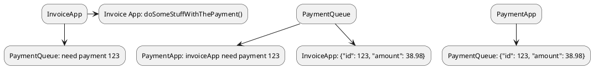

# Resiliency and Availability Design Patterns for the Cloud

### **Type** : *Backend - Cloud*

### **Speaker** : *Sébastien Stormacq*

### **Résumé** :

Les systèmes distribués sont difficiles.

De là, admettons un fait : "ça" va tomber en panne.

Anticipons donc la "failure" dans le dev de nos applis.

On appelle cela la résilience.

Elle est atteinte par l'association de plusieurs techniques, que voici.

## I. La disponibilité géographique

Cela consiste à répartir les nœuds d'un cluster sur plusieurs datacenters espacés géographiquement, et qui sont chacun sensibles à des types de pannes différentes.

Une gestion d'état de ces datacenter permet de switcher automatiquement sur ceux en bonne santé.

## II. L'auto-scaling

C'est le fait de démarrer automatiquement de nouveaux noeuds lorsque la charge augmente.

C’est un scaling horizontal.

On le distingue du scaling vertical, où on se contente d'augmenter les performances des serveurs hôtes.

## III. Decoupling and asynchronisme

"Découpler" (instaurer un couplage faible) permet de rendre le système modulaire : on peut en remplacer/modifier un module sans devoir toucher aux autres.

C'est le S de SOLID : Single Responsability Principle.

On peut découpler 2 applications RESTFUL synchrones on les désynchronisant.

### Fonctionnement synchrone

```puml
@startuml
InvoiceApp -> PaymentApp: /search/invoice/123
activate PaymentApp
InvoiceApp <-- PaymentApp: {"id": 123, "amount": 38.98}
deactivete PaymentApp
InvoiceApp -> Invoice App: doSomeStuffWithThePayment()
@enduml
```

### Fonctionnement asynchrone



Ainsi, les 2 applications sont découplées, elles fonctionnent indépendament à l'aide de queues et d'interfaces json (openApi et/ou asyncApi).

Si l'une d'elle à une défaillance, la queue se remplira toujours, et sera consommée lors du retour à la normale.

On affectera alors des priorités aux queues afin de choisir précisément quels services on souhaite dégrader en cas de défaillance.

## Databases

Et si on séparait les responsabilité read/write ?

```puml
@startuml
database master \n read/write
database replicat 1 read-only
database replicat 2 read-only
@enduml
```

On peut à présent :
* dégrader les services en read-only (plutôt que de fermer totalement)
* Scaler horizontalement les bases
