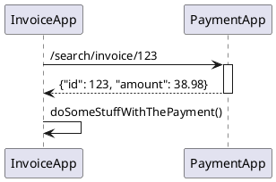
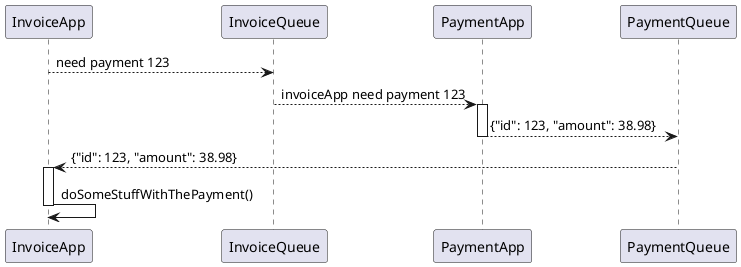
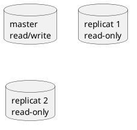
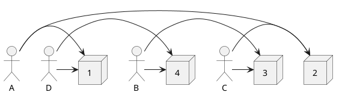

# Resiliency and Availability Design Patterns for the Cloud

### **Type** : *Backend - Cloud*

### **Speaker** : *Sébastien Stormacq*

### **Résumé** :

## Table of Contents

- [Resiliency and Availability Design Patterns for the Cloud](#resiliency-and-availability-design-patterns-for-the-cloud)
  - [Intro](#intro)
  - [I. La disponibilité géographique](#i-la-disponibilit-gographique)
  - [II. L'auto-scaling](#ii-lauto-scaling)
  - [III. Le Decoupling and asynchronisme](#iii-le-decoupling-and-asynchronisme)
    - [1.) Fonctionnement synchrone](#1-fonctionnement-synchrone)
    - [2.) Fonctionnement asynchrone](#2-fonctionnement-asynchrone)
  - [IV. Databases](#iv-databases)
    - [1.) Database sharding](#1-database-sharding)
  - [V. Timout, Backoff, Retries](#v-timout-backoff-retries)
  - [VI. Retries & Backoff](#vi-retries-backoff)
    - [1.) L'exponential Backoff](#1-lexponential-backoff)
    - [2.) Jitter](#2-jitter)
  - [VII. Health checking](#vii-health-checking)
  - [VIII. Load Shedding](#viii-load-shedding)
  - [IX. Sharding](#ix-sharding)
  - [X. Pour finir](#x-pour-finir)

## Intro

Les systèmes distribués sont difficiles.

De là, admettons un fait : "ça" va tomber en panne.

Anticipons donc la "failure" dans le dev de nos applis.

On appelle cela la résilience.

Elle est atteinte par l'association de plusieurs techniques, que voici.

## I. La disponibilité géographique

Cela consiste à répartir les nœuds d'un cluster sur plusieurs datacenters espacés géographiquement, et qui sont chacun sensibles à des types de pannes différentes.

Une gestion d'état de ces datacenter permet de switcher automatiquement sur ceux en bonne santé.

## II. L'auto-scaling

C'est le fait de démarrer automatiquement de nouveaux noeuds lorsque la charge augmente.

C’est un scaling horizontal.

On le distingue du scaling vertical, où on se contente d'augmenter les performances des serveurs hôtes.

## III. Le Decoupling and asynchronisme

"Découpler" (instaurer un couplage faible) permet de rendre le système modulaire : on peut en remplacer/modifier un module sans devoir toucher aux autres.

C'est le S de SOLID : Single Responsability Principle.

On peut découpler 2 applications RESTFUL synchrones on les désynchronisant.

### 1.) Fonctionnement synchrone

### 2.) Fonctionnement asynchrone

Ainsi, les 2 applications sont découplées, elles fonctionnent indépendamment à l'aide de queues et d'interfaces json (openApi et/ou asyncApi).

Si l'une d'elle à une défaillance, la queue se remplira toujours et sera consommée lors du retour à la normale.

On affectera alors des priorités aux queues afin de choisir précisément quels services on souhaite dégrader en cas de défaillance.

## IV. Databases

Et si on séparait les responsabilité read/write ?

On peut à présent :
* dégrader les services en read-only (plutôt que de fermer totalement)
* Scaler horizontalement les bases

### 1.) Database sharding

Une autre option de résilience et de scaling de database est le sharding, qui consiste à répartir les data sur plusieurs databases. 

Par exemple :
* ids 1 à 10 -> le shard 1
* ids 11 à 20 -> le shard 2
* ...

## V. Timout, Backoff, Retries

La quasi-totalité de nos outils a des valeurs de timeout par défaut, parfois (souvent) élevées.

Exemple : un HTTP GET sans réponse depuis 4 secondes, et qui attendra en tout 10 secondes avant d'arrêter son attente et de remonter une exception technique.

Dans un flux métier complexe où plusieurs appels http se succèdent, la somme des timeout au bout de ce flux est conséquente.

On peut alors avoir des boards de supervision, la panne mettra (trop ?) longtemps à y apparaitre.

De plus, dans le cas d'une forte volumétrie d'appels, une application qui cesse de répondre va mettre en attente une quantité d'appels si importante que le nombre de connexions max sera atteints, et boum -> tout tombe.

On préfère là aussi une dégradation de service à un arrêt total.

La solution : abaisser fortement les temps de timeout ! Probablement < 1 seconde

Les latences réseaux inévitables vont alors faire échouer quelques requêtes, qui auraient pu passer à la 1003ème ms.

On résout ce problème-ci avec des retries (réessaies).

## VI. Retries & Backoff

Il est toutefois nécessaire de répartir dans le temps les retries de tous les threads, afin d'éviter qu'ils se produisent tous en même temps > Cela lisse la charge.

On peut faire cela en associant 2 stratégies :

### 1.) L'exponential Backoff

On fait attendre les clients de plus en plus longtemps à chaque nouveau retry :

### 2.) Jitter

On introduit une variance aléatoire aux backoff times :

## VII. Health checking

Si on veut réagir aux failures, il faut les détecter au plus tôt, c'est pourquoi on mettra en place des demandes de health check récurrents, dont voici 2 modes :
* Shallow health check -> How are you ?
* Deep health check -> How are you and can you ask your whole friends how they are ? 

## VIII. Load Shedding

Ce concept-là consiste à réagir à une failure en mettant en file d'attente les éléments à y envoyer, plutôt que de ne pas les envoyer du tout.

## IX. Sharding

Dans un cluster load balancé, on assigne 2 à 3 nœuds par client, de manière que la chute d'un unique noeuds ne fasse tomber aucun client.

## X. Pour finir

Bien que j'eusse déjà connaissance de ces techniques (par la lecture de la doc de resilience4J), c'était passionnant d'écouter Sébastien Stormacq les illustrer avec des exemples simples. 

Ce talk me les a donc remis en tête, jusqu'à ce que je les applique en production.

Outre le contenu passionnant, la prestation orale était inspirante et j'ai donc passé un excellent moment d'apprentissage.

Pour finir, il nous donne quelques lectures et outils liés à la résilience :
* Chaos Engineering
  * Netflix
  * SimianArmy
* AWS well architectured tool
* Medium : Adrian Hornsbt
* Amazon builders library
