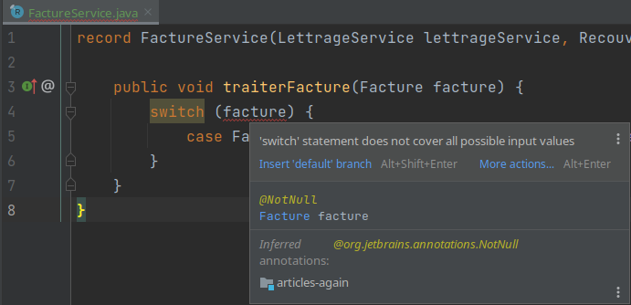
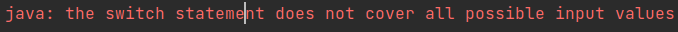

= Java 17, le record & pattern matching c’est pour maintenant ?
Antoine Salesse - a.salesse@younup.fr
:toc: preamble
:caution-caption: ⚠
:tabsize: 2
:source-highlighter: rouge
:docinfo: private

Promis juré, cet article n’est pas une liste des "nouvelles fonctionnalités de Java" (https://docs.oracle.com/javase/specs/jls/se17/html/index.html[JLS]footnote:[JLS : Java Language Specification] /
https://stackoverflow.com/a/51286665[JSR]footnote:[JSR : Java Specification Request] / https://stackoverflow.com/a/51286665[JEP]footnote:[JEP : JDK Enhancement Proposal]).

Depuis sa sortie en septembre 2021, les articles sur Java *17* pleuvent.

Ok, ça y est, on a bien compris que cette version est une https://stackoverflow.com/a/51286665[LTS]footnote:[LTS : Long Term Support].

Mais c’est aussi bien plus que cela. +
C’est une milestone de l’objectif ambitieux nommé +
*"Record and Array Pattern Matching"*.

Cet objectif est un ensemble de fonctionnalités synergiques :

* Les `instanceof` avec "Type Patterns" (dispo en 16)
* Les Switch on Patterns (Java 17 preview, et probablement dispo en 19)
* La déconstruction de `record` (Peut-être Java 19 preview)
* La déconstruction d’array (Java 19+ ?)
* Les imbrications de patterns (pas de visibilité de dispo)

C’est donc de ces features dont on parle ici :

* À quoi elles servent ?
* Comment et dans quels contextes les utiliser ?
* Qu’apportent-elles à notre code ?

Et avec bien sûr des exemples de code !

== Les applications de gestion aujourd’hui

Aujourd’hui le design de nos backend d’applications de gestions pousse (🌱) autour d’une problématique : +
*Faire varier des comportements en fonction de cas d’usage*

Dans ce genre d’applications, quelle que soit l’architecture choisie ou le style dev, on se retrouve à un moment ou un autre à :

1.{nbsp}Modéliser notre domaine métier ::
Cela peut être fait dans un package spécifique avec des POJO, ou avec des `Entity` JPA. +
La seconde option est la plus répandue, mais ce n’est pas ma préférée.
Je trouve que c’est une erreur de concevoir le business d’une application autour d’une base de données. +
2.{nbsp}Écrire des DTO ::
Dans l’idéal, un dto est immutable (Il n’y a aucune raison de changer la représentation d’une donnée transmise à un moment T). +
Le Record est la structure de données la plus appropriée. +
Sinon, avant Java 14, on a les `@Value` de Lombok.

Dans nos applications modulaires, on peut avoir envie de partager ces structures de données entre les modules :

[plantuml,Modèle du domain Facture,png]
----
@startuml
allow_mixing

node "Domain model" {
	class Facture
}

node "Module lettrage" {
	usecase usecaseLettragePartiel
	usecaseLettragePartiel - Facture
}

node "Module recouvrement" {
	usecase usecasePremiereRelance
	usecasePremiereRelance - Facture
}

@enduml
----

Et bien pour faire varier les comportements des actions affectant ces classes, la POO nous incite à ajouter des méthodes sur nos classes de domaine. +
//En effet, c’est un Objet, il a un état, et il peut porter des méthodes consommant ou modifiant cet état.

Par exemple, pour la domain-class `Facture`, le module lettrage pourrait vouloir ajouter une méthode `calculerMontantRestantAPayer()`. +
Le module envoie pourrait vouloir une méthode `getDestinataires()`.

[plantuml,Modèle de domaine avec Facture et cas d’utilisation,png]
----
@startuml
allow_mixing

node "Domain model" {

	class Facture implements MontantCalculable, Envoyable {
	Integer calculerMontantRestantAPayer()
	List<Personne> getDestinataires()
  }

  interface MontantCalculable
  interface Envoyable
}

node "Module lettrage" {
  usecase usecaseLettragePartiel
  usecaseLettragePartiel - Facture
}

node "Module envoi" {
  usecase usecasePremiereRelance
  usecasePremiereRelance - Facture
}

@enduml
----

[source,java]
----
class Facture implements MontantCalculable, Envoyable {
	private String libelle;
	private CodeFacture code;
	private Client client;
	private Reçu reçu;
	private Devise montant;

	@Override
	public Integer calculerMontantRestantAPayer(){
		...
	}

	@Override
	public List<Personne> getDestinataires(){
		...
	}

	...
}
----

Au bout d’un moment, notre domain-class `Facture` a beaucoup de méthodes issues de différents modules. +
Le module lettrage utilise `Facture` et se retrouve à pouvoir appeler les méthodes du module d’envoi ; ce qui viole au moins :

* Le https://fr.wikipedia.org/wiki/Principe_de_s%C3%A9gr%C3%A9gation_des_interfaces[principe de ségrégation des interfaces]
* Le https://fr.wikipedia.org/wiki/Principe_de_responsabilit%C3%A9_unique  [principe de responsabilité unique] (Car La class Document a maintenant 2 raisons de changer : le contexte _lettrage_ et le contexte _envoi_)

Effet bonus : Quand on change `Facture` dans le cadre du contexte _lettrage_, on doit recompiler/relivrer aussi le contexte _envoi_.

=== Solution : séparer la logique métier des structures sur lesquelles elle agit

Pour y parvenir, on utilisait jusque-là 3 patterns :

* Le https://en.wikipedia.org/wiki/Visitor_pattern#Sources_3[visitor pattern]footnote:["Today, to express ad-hoc polymorphic calculations like this we would use the cumbersome visitor pattern". source : https://openjdk.java.net/jeps/405]
* Le https://en.wikipedia.org/wiki/Delegation_pattern[delegate pattern]
* Le pattern service-everywhere avec des méthodes à 8 arguments (un anti-pattern d’après moi), qui nait de la programmation procédurale

Mais à présent avec Java 17, une quatrième solution élégante s’offre à nous : Le Pattern Matching.

== Mais qu’est-ce que le pattern matching ?

Je pense qu’on ne peut pas couper à la définition de Wikipédia :

[quote,https://en.wikipedia.org/wiki/Pattern_matching]
--
In computer science, pattern matching is the act of checking a given sequence of tokens for the presence of the constituents of some pattern.
--

On a tendance à penser alors aux expressions régulières, mais non, il ne s’agit pas de cela.

Là, les patterns à matcher sont des structures de données :

* Des classes
* Des interfaces
* Des array
* Et bien sûr des records !

Je trouve que le cas du matching sur `instanceof` avec Type-Pattern est le plus facile à comprendre. +
Avant Java 17, on avait ça :

[source,java]
----
if (facture instanceof FacturePayée) { // Oui je mets des accents dans mon code français. La sémantique !
	lettrageService.lettrer(((FacturePayée) facture));
	return;
}
if (facture instanceof FactureDue) {
	recouvrementService.relancer(((FactureDue) facture));
}
----

Et à présent :

[source,java]
----
if (facture instanceof FacturePayée facturePayée) {
	lettrageService.lettrer(facturePayée);
	return;
}
if (facture instanceof FactureDue factureDue) {
	recouvrementService.relancer(factureDue);
}
----

Ici le pattern à matcher est l’appartenance aux classes `FacturePayée` et `FactureDue`.
On teste si l’instance a un des types, et un cast implicite est fait vers une "binding variable" (`facturePayée` ou `factureDue`).

== Comment le Pattern Matching remplace-t-il le visitor pattern ?

J’ai promis des exemples de code, les voici.

Voici l’implémentation du visitor pattern avec le modèle de Facture :

[source,java]
----

interface FactureVisitable {
	default void accept(FactureVisitor factureVisitor) {
		factureVisitor.visit(this);
	}
}

abstract class Facture implements FactureVisitable {
}

class FacturePayée extends Facture {
}

class FactureDue extends Facture {
	private Integer nombreRelance = 0;

	public void incrementerNombreRelance(){
		nombreRelance++;
	}

	public boolean aDejaEteRelancée() {
		return nombreRelance >= 1;
	}
}

interface FactureVisitor {
	void visit(FacturePayée facturePayée);

	void visit(FactureDue factureDue);
}

interface ServiceLettrage {
	void lettrer(FacturePayée facturePayée);
}

interface ServiceRecouvrement {
	void relancer(FactureDue factureDue);
}

record MainFactureVisitor(ServiceLettrage serviceLettrage, ServiceRecouvrement serviceRecouvrement) implements FactureVisitor {

	@Override
	public void visit(FacturePayée facturePayée) {
		serviceLettrage.lettrer(facturePayée);
	}

	@Override
	public void visit(FactureDue factureDue) {
		serviceRecouvrement.relancer(factureDue);
	}
}

record FactureService(MainFactureVisitor mainFactureVisitor) implements TraitementFacture {

	public void traiterFacture(Facture facture) {
		facture.accept(mainFactureVisitor);
	}
}

----

On observe que le rapport code utile/pure invention n’est pas excellent.

Et maintenant :

[source,java]
----
record FactureService(LettrageService lettrageService, RecouvrementService recouvrementService) implements TraitementFacture {

	public void traiterFacture(Facture facture) {
		if (facture instanceof FacturePayée facturePayée) {
			lettrageService.lettrer(facturePayée);
			return;
		}
		if (facture instanceof FactureDue factureDue) {
			recouvrementService.relancer(factureDue);
		}
	}
}
----

Le FactureService se suffit à lui-même, et la lisibilité me semble très acceptable.

Mais avez-vous remarqué quelque chose dans ce dernier bout de code ?

Le cas où `facture` est d’un autre type n’est pas géré ! +
Et non, pas de `throw new NotImplementedException()` cette fois-ci. +

C’est là que la fonctionnalité Java 15 de types scellés intervient. +
Modifions un peu notre modèle :

[source,java]
----
abstract sealed class Facture permits FacturePayée, FactureDue {
}

final class FacturePayée extends Facture {
}

final class FactureDue extends Facture {
	private Integer nombreRelance = 0;

	public void incrementerNombreRelance(){
		nombreRelance++;
	}

	public boolean aDejaEteRelancée() {
		return nombreRelance >= 1;
	}
}
----

Traduction en français : ::
Il n’existe que 2 types de Facture possibles : FacturePayée et FactureDue. +
Ces dernières ne peuvent être étendues. +
Point.

Cela donne donc :

[source,java]
----
record FactureService(LettrageService lettrageService, RecouvrementService recouvrementService) implements TraitementFacture {

	public void traiterFacture(Facture facture) {
		switch (facture) {
			case FacturePayée facturePayée -> lettrageService.lettrer(facturePayée);
			// case FactureDue factureDue -> recouvrementService.relancer(factureDue);
		}
	}
}
----

J’ai commenté le cas de la `FactureDue` afin d’observer ce que nous disent le compilateur et l’ide :

On doit alors déclarer le `Consumer<? extends Facture>` de tous les cas restants, ou bien les grouper dans un `default` :

[source%linenums,java,highlight=6..7]
----
record FactureService(LettrageService lettrageService, RecouvrementService recouvrementService) implements TraitementFacture {

	public void traiterFacture(Facture facture) {
		switch (facture) {
			case FacturePayée facturePayée -> lettrageService.lettrer(facturePayée);
			// case FactureDue factureDue -> recouvrementService.relancer(factureDue);
			default -> LOGGER.info("Cool y a rien à faire pour le cas là !");
		}
	}
}
----

Avec cette syntaxe, le langage nous apporte une validation métier de plus à la compile time (soit plus tôt qu’à la runtime ou encore à la _prodtime_). +
C’est les TDDistes qui sont contents.

Et si on allait encore plus loin ? +
Allez, ajoutons une feature preview de Java 17 : un "Guarded Pattern"

[source%linenums,java,highlight=9..9]
----
record FactureService(
		LettrageService lettrageService,
		RecouvrementService recouvrementService)
		implements TraitementFacture {

	public void traiterFacture(Facture facture) {
		switch (facture) {
			case FacturePayée facturePayée -> lettrageService.lettrer(facturePayée);
			case FactureDue factureDue && factureDue.aDéjàÉtéRelancée() -> recouvrementService.demarrerRecouvrement(factureDue);
			case FactureDue factureDue -> recouvrementService.relancer(factureDue);
		}
	}
}
----

Alors c'est très bien tout ça, mais l’objectif à terme du pattern matching va encore plus loin en ce qui concerne les records. +

Reprenons notre exemple de `Facture`, mais considérons qu'elle vient d'arriver d'un `Controlleur` sour forme de DTO (et donc de record) :

[source,java]
----
record Facture(String code, String libellé, Integer montant, ZonedDateTime dateCréation, ...){}
----

Je ne lui donne que quelques champs, mais considérons en plus qu'il y a en une vingtaine, une centaine, beaucoup...

Quand je veux mapper cette facture vers un usecase, alors ce dernier n'a très certainement besoin que de seulement quelques-uns de ces champs. Le code suivant serait donc une erreur de design :

[source%linenums,java,highlight=8..8]
----
@RestController
class FactureControlleur {

	@PostMapping
    @ResponseStatus(HttpStatus.CREATED)
    public Long create(@RequestBody Facture facture) {
        Preconditions.checkNotNull(facture);
        notifierNouvelleFactureUseCase.handle(facture);
		return factureService.handle(facture)
    }
}
----

On va pouvoir (Java >= 19) les déconstruire.

/!\ On passe maintenant sur du code qu

// todo : introduire un exemple qui justifie de décrire la d3construction

== Qu’est-ce que la "déconstruction"

Ce concept a un objectif similaire au I de SOLID : la ségrégation.

Si je reçois un objet avec 42 champs alors que j’en ai besoin que de 2, la "_deconstruction on pattern_" va m’aider.

Regardons ça avec du code.

J’ai mon énorme dto reçu :

[source,java]
----
public record Product(
  String type,
  String price,
  String name,
  // imaginez ici 39 autres champs
){}
----

Mais la règle métier que je veux appliquer ne porte que sur le `type` et le `price`.
Je peux alors étendre le concept de `instanceof` précédent, en lui ajoutant une déconstruction du Record "Product" :

[source,java]
----
if (object instanceof Product(String type, String price)) {
  myUseCase.execute(type, price);
}
----

Ici, `type` et `price` sont des "binding variables" générées implicitement si l’`object` match le pattern `Product`.

=== Et ça sert à quoi ?

Tout seul comme ça, pas encore grand-chose.

//Cela répond à un besoin fondamental des développeurs : faire varier des comportements à la Runtime. Pour un type on veut le comportement A, et pour un autre on veut le comportement B.

Pour le cas du `instanceof`, on gagne toutefois nettement en intelligibilité du code.

Comparez plutôt avec la méthode habituelle :

[source,java]
----
if (vehicle instanceof Car) {
  ((Car) vehicle).drive();
} else if (vehicle instanceof Plane) {
  ((Plane) vehicle).fly();
}
----

[source,java]
----
if (object instanceof Product) {
  String type = ((Product) object).type;
  String price = ((Product) object).price;
  myUseCase.execute(type, price);
}
----

Mais là où ça prend tout son intérêt, c’est quand on y ajoute le concept de classe scellée dans un "Switch on Pattern".

Voyons cela.

[source,java]
----
public sealed interface Document permits Invoice, Contract {}
public record Invoice(int amount, String buyer, String Seller) implements Document {}
public record Contract(List<String> parties, List<String> formalities, List<String> terms) implements Document {}
----

Ici, grâce au mécanisme de sceau (`sealed`), on indique au compilateur la liste exhaustive des implémentations de Document :

* Invoice
* Contract

Les DTO `Invoice` et `Contract` sont reçu dans les modules Customer, Administrator et Partner (1 module = 1 context métier).

Pour chaque implémentation, on veut effectuer des validations métiers différentes.

La méthode habituelle de la programmation orientée object, c’est d’avoir une méthode `void validate()` dans l’interface Document, et de la faire implémenter par Invoice et Contract.

Le problème avec ça, c’est que

Mettons alors qu’on reçoive un DTO Document.

Implémentons la sélection de la validation à appliquer à l’aide

[source,java]
----

----

Implémentons la sélection de la validation à appliquer à l’aide d’un "Switch on Pattern" :

[source,java]
----

----

== Qu’est-ce que ça va apporter à notre code ?

Plus de validation à la compile-time, et donc :

* Plus de sécurité
* Développer plus intuitivement (le compilateur nous dis ce qu’on a oublié)
* Faire émerger de meilleurs designs

=== Dans quels langages on en trouve déjà

* https://docs.scala-lang.org/tour/pattern-matching.html[Scala]
* https://doc.rust-lang.org/rust-by-example/flow_control/match.html[Rust]

== Conclusion

== brainstorm area

* Pattern guards, Guarded Pattern
* Sealed classes
* Expressivité
